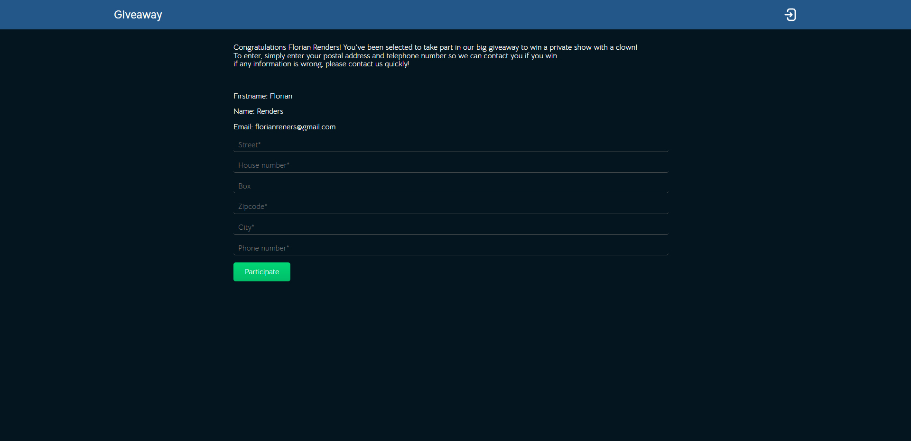
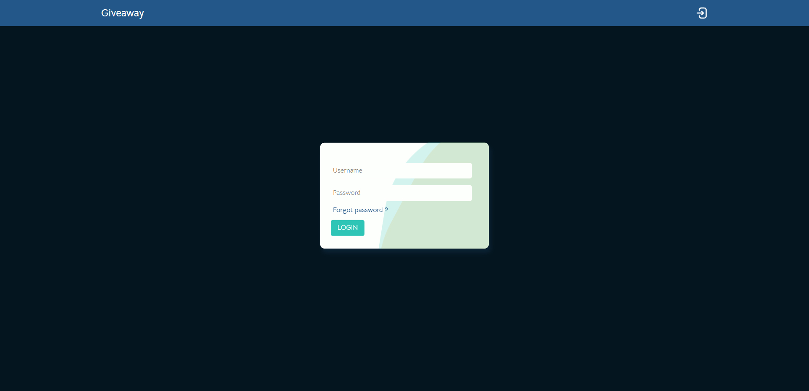
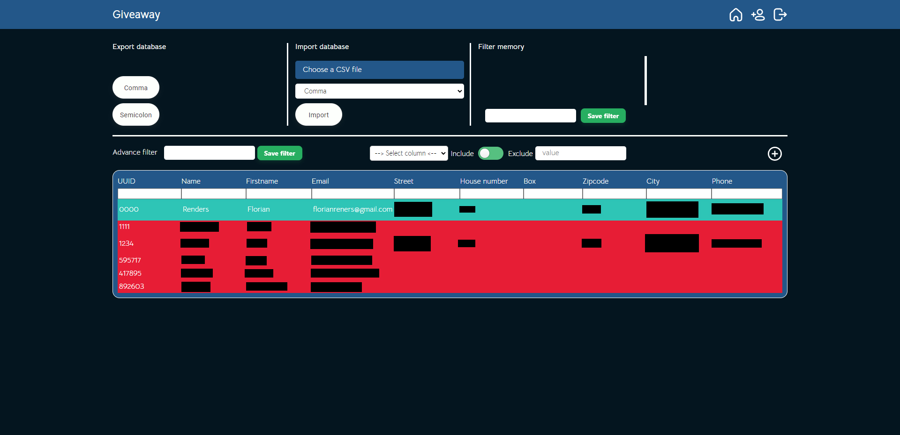

# Giveaway CRM

This fictitious project simulates a giveaway with an admin page.

## Features

- Form requiring a UUID in the url
- Distinguish whether the user has already answered the form or entered the wrong UUID
- Login page
- Export to CSV (comma or semicolon)
- Import in CSV (comma or semicolon)
- Sort & Filter per column
- Advanced Filter
- Filter memory

## Tech Stack

**Client:** HTML, SCSS, JS, Webpack

**Server:** PHP, MySQL

## Screenshots

